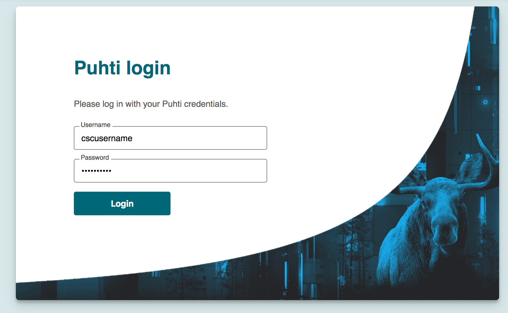

# Provisioning  a custom Jupyter notebook on Puhti web interface for NMRLipids course (WIP)

Computational environment for NMRLipids course (AKA, NMRlipids summer school 2022) at CSC supercomputer (Puhti) can be accessed using a custom Jupyter notebook provisioned through Puhti web interface (https://www.puhti.csc.fi). The customisation of environment involves the following steps:

- [Installing necessary python packages to projappl directory using tykky] (#Installing-necessary-python-packages-to-projappl-directory-using-tykky)
- [Creating a course environment/module(s)](#Creating a course environment/module(s))
- Accessing notebook via Puhti web interface
- [Useful CSC documentation](#Useful CSC documentation)

### Installing necessary python packages to projappl directory using tykky:

Tykky is a set of tools which wrap installations inside an Apptainer/Singularity container to improve startup times, reduce IO load, and lessen the number of files on large parallel filesystems.

Additionally, Tykky will generate wrappers so that installed software can be used (almost) as if it were not containerized. Depending on tool selection and settings, either the whole host filesystem or a limited subset is visible during execution and installation. This means that it's possible to wrap installation using e.g mpi4py relying on the host provided mpi installation.

This documentation covers a subset of the functionality and focuses on conda and Python, a large part of the advanced use-cases are not covered here yet.

### Accessing notebook via Puhti web interface

1. Access Open OnDemand (OoD) interface on [Puhti login page](https://www.puhti.csc.fi/public/login.html)
2. Login with CSC or course credentials (Users should have accepted Puhti service in [myCSC](https://my.csc.fi/welcome) page under a course ( or own) project before using this service). Login page is as shown below:

3. Once login is successfull, select "Apps" on the top menu bar and then click "Gromacs course". Fill all the necessary information ( e.g., select your CSC project, partition (use "small" when using reservation), computing resources among others) and then click "Launch" 
4. Upon successful launching a job, you can see the following window: 

5. Click on "Connect to VNC" to launch GUI desktop to then VMD (see below picture) 
7. Again on OoD job page, click on "Connect to Jupyter" to launch Gromacs notebook.

### Creating a course environment/module(s)

The files for course environments (modules) can be created in /projappl/<project>/www_puhti_modules/. The www_puhti_modules directory can be created if it does not exist.

The course environment is only visible for the project that it was created for. Note that you may need to Restart Web Server in the Help menu in the web interface if the course environment is not visible in the form after creating the files and selecting the correct project.

Two files are needed for the course modules:

    a <course>.lua file that defines the module that sets up the Python environment. Only files containing the text Jupyter will be visible in the app.
    a <course>-resources.yml that defines the default resources used for Jupyter.
  

###  Useful CSC documentation

- Jupyter for course (https://docs.csc.fi/computing/webinterface/jupyter-for-courses/)
- Tykky containerisation (https://docs.csc.fi/computing/containers/tykky/)

